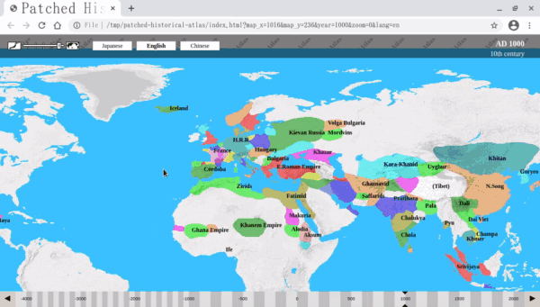

# Patched Historical Atlas - interactive world map (4000BC-20XX, every year) on web browser

## What is this?

This is just a modification to [World Historical Atlas](http://x768.com/w/twha.en) for some convenient features.

* Support mouse drag on the year bar.
* Enable bookmarking of the "current view" on your browser.
* Add keyboard shortcuts for forward/backward animations.
* Add period bars for regions and persons.

## Usage

* Download the original twha5.zip (September 23, 2019 1:34 PM UTC) from [World Historical Atlas](http://x768.com/w/twha.en) and unzip it.
* Download patched-historical-atlas-main.zip as follows.
  * Open https://github.com/kaorahi/patched-historical-atlas .
  * Click the green "Code" button.
  * Select "Download ZIP".
* Unzip patched-historical-atlas-main.zip and copy all the files in patched-historical-atlas-main to the original twha5 (overwrite).
* Open index.html in twha5 with Firefox, Chrome, etc. to start browsing the atlas.

## Keyboard Shortcuts

* `,` / `.` (or `LeftArrow` / `RightArrow`): move backward/forward 10 years
  * with `Shift`: jump 100 years
  * with `Ctrl`: previous/next year
* `[` / `]`: previous/next year
* `Home` / `0` / `1` / `End`: jump to the oldest year/1 A.D./1000 A.D./the newest year
* `Enter`: input the year directly as if you clicked the year at the top right
* `z` / `Z` (or `z` / `x` or `i` / `o`): zoom in/out
* `Ctrl-Space`: put the "current view" to the browser history so that you can go back to it later by `Back` button of the browser

## License

See LICENSE file.
